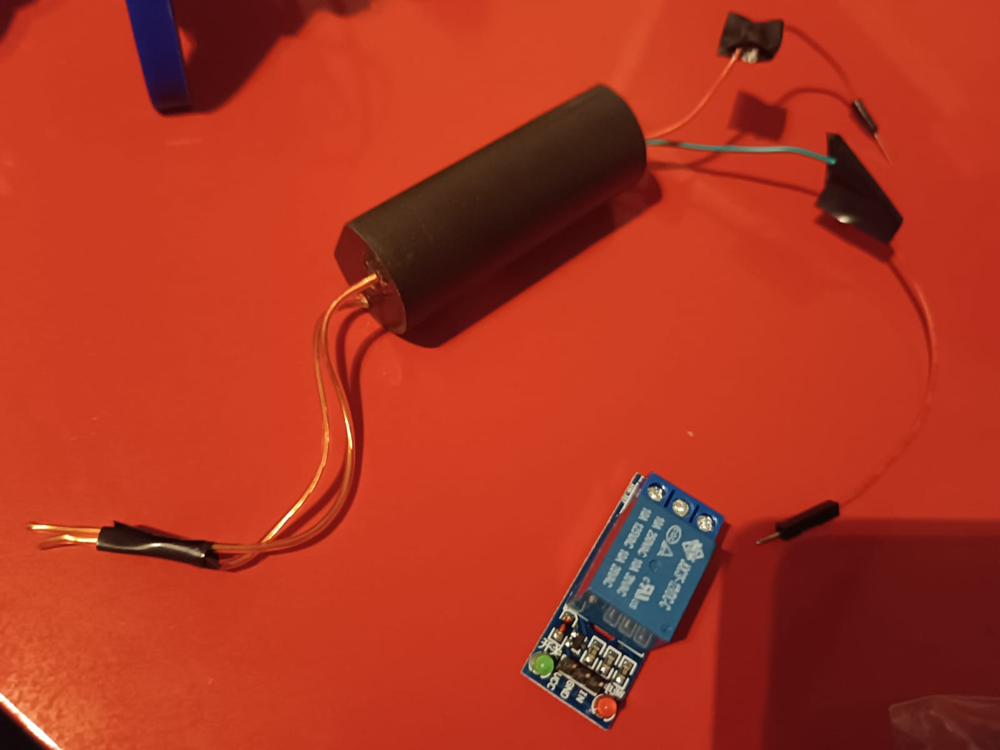

# Arduino-Spider-Bot
Arduino-based SpiderBot, remotely controllable, with obstacle detection and automated walk. Inspired by TokyoBird but with lots of changes. ⚡ NEW UPDATE: Now the robot comes with a super-cool 50.000 volts taser!!! 

# 🔋 Parts and Robotics

The 3d files are located in the `3d files` folder. \
Other parts:
- 8 servo motors (90° degrees position)
- Ultrasonic sensor HC-SR04
- Arduino Nano + Arduino Nano expansion board
- Bluetooth Module Hc-05
- Jumpers, screws n other stuff
- 2 Lithium Batteries (+ case)
- Buck Converter (+ ammeter)
- High voltage generator (5-8v input : 50.000v output)
- Small relay

How to build: simply follow the instructions on [TokyoBird](https://www.thingiverse.com/thing:4905975)'s page.  \
Here are the changes i've made: 
- I used the HC-05 module to send commands instead of the Serial Monitor.
- I attached a Taser to it, i can activate it whenever i want to.
- I used 2 lithium batteries soldered to a buck converter (the output is set to 5v, but if the batteries are 3.7v each you technically should be able to ignore the buck converter and attach the batteries directly to the board), my batteires were 4.2v each so i preferred to use the converter.
- I updated the code to make it easily compatible with Bluetooth app ([this one](https://play.google.com/store/apps/details?id=com.giumig.apps.bluetoothserialmonitor&hl=en&gl=US&pli=1)).
- Because the servos i used are not original, the fins are too big to fit in the 3d printed legs, so i used my soldering iron to make the gaps bigger and i fixed the fins with some tape, although glue would be better.
- I added a shell to cover all the cables (u can find it in the 3d print files folder).
- Modified some animations to avoid issued related to voltage supply and current, i noticed that if the bot is not powered by batteries (so simply by pc cable) there can be current shortages mid-animations, so i amplified some delays and made some changes.

# 💻 Code

The **`first code`** is quite simple, every second or so the hc05 bluetooth module checks for input to send to the robot, it serial prints them (for debugging purposes) and sends the data to the robot which will execute the animations. 
Unfortunately there is no way to make the walking animation possible using a joystick, as the walking functions are not simple motors but complex things. The only way to use it is to push the Walk Forward button every time.... yeah its annoying but its all i can do. I customized the buttons on the right:
- Triangle: wink animation, the robot says hello
- Square: sit animationn, the robot slowly sits, does weird poses and goes back up
- Circle: twist animation, i cannot even describe it, the robot twists all its legs in and out
- X: sit2 animation, the robot sits (and doesnt stand up)
- Select: uses taser

The **`second code`** is the automated walk code, it uses the ultrasonic sensor to see if anything is in a range of a few centimiters, and if there is, the robots slowly backs up and changes direction. \
Here is a video showcasing it, i didnt solder the batteries yet so it was powered by the pc

https://github.com/Hue-Jhan/Arduino-Spider-Bot/assets/75088696/948d0f76-3dea-49bb-976c-75f6bf47370e

# ⚡ Taser

Using a relay i can remotely activate a high voltage generator, it uses the same lithium batteries the other components use. It hurts. a lot.

https://github.com/user-attachments/assets/529a7c71-5bb1-40c3-ae3d-1470e08477f8

Remember to insert a switch between the battery case and the dc converter or othwerise it will **blow up** due to overheating, as the buck converter always tries to "get" current from the batteries
